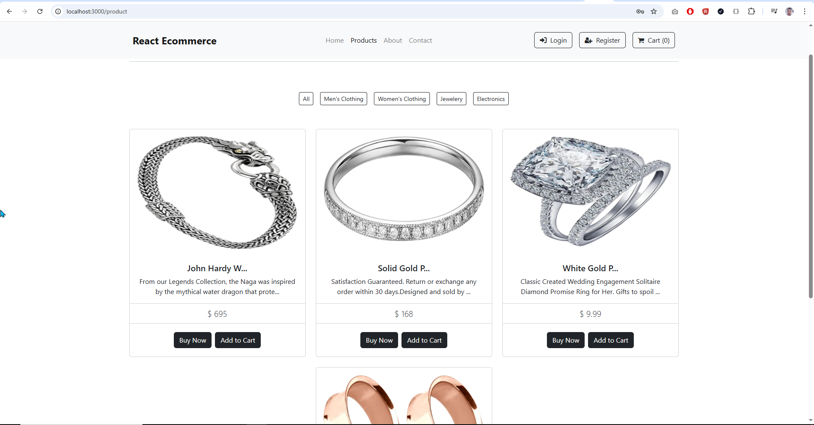

#### Test cases with bugs - React ecommerce

**Test Case ID:** TC003  
**Title:** Add a product to the cart and go to checkout to complete the purchase

**Steps:**
1. Given I am on the React Ecommerce home page
2. When I navigate to the Products page
3. And I select "Jewelery" category
4. And I add the item "Pierced Owl" to the cart
5. And I go to the cart page
6. Then the added item should be displayed in the cart
7. And the product's quantity and payment information should be listed
8. Then I go to the checkout page 
9. And I fill in the billing address and payment information
10. And I validate the order summary
11. And I click the "Continue to checkout" button
12. Then I go to the purchase confirmation page

---

**Evidences:**

1. 

2. 

3. 

4. 

5 - 6 - 7.

8 - 9 - 10.

11 - 12. 
N/D - bug

---

**Bug:**
**Title:** Continue to checkout button doesn't work

**Steps to Reproduce**
1. Navigate to the Products page
2. Select the "Jewelery" category
3. Add an item to the cart
4. Navigate to the cart page
5. Navigate to the checkout page
6. Fill in the billing address and payment information
7. Click the "Continue to checkout" button

**Actual Result**
- The "Continue to checkout" button is disabled 

**Expected Result** 
- The "Continue to checkout" button should be enabled
- After clicking, the user should go to the purchase confirmation page

**Suggestion**
- Review DB configuration (mongoDB and SQL)

**Evidence**
- Test Case ID: TC003 

**Severity**
- Critical

**Test Case ID:** TC004 
**Title:** Register a new user

**Steps:**
1. Given I am on the React Ecommerce home page
2. When I navigate to the Register page
3. And I fill all the required fields
4. And I click in the "Register" button
5. Then the system displays a success message

---

**Evidences:**

1. 

2. 

3. 

4 - 5 - 6.
N/D - bug

---

**Bug:**
**Title:** Register button doesn't work

**Steps to Reproduce**
1. Navigate to the Register page
2. Fill all the required fields
3. Click in the "Register" button

**Actual Result**
- The "Register" button is disabled 

**Expected Result** 
- The "Register" button should be enabled
- After clicking, the system should display a success message

**Suggestion**
- Review DB configuration (mongoDB and SQL)

**Evidence**
- Test Case ID: TC004 

**Severity**
- Critical

**Test Case ID:** TC005 
**Title:** Validate "You may also Like" carousel 

**Steps:**
1. Given I am on the React Ecommerce home page
2. When I navigate to the Products page
3. And I add the item "SanDisk SSD" to the cart
4. And I click the "Buy Now" button
5. Then I go to the individual product page
6. And I scroll to the "You may also like" section
7. And I validate that there is a carousel with similar products
8. And I validate that there are cards with images of similar products in the carousel
9. And I validate that there are cards with the names of similar products in the carousel
10. And I validate that there are cards with a "Buy Now" button for similar products in the carousel
11. And I validate that there are cards with an "Add to Cart" button for similar products in the carousel

---

**Evidences:**

1. 

2. 

3. 

4. 

5. 

6 - 7. 

8. -> BUG 

9 - 10 - 11.
 

---

**Bug:**
**Title:** Continue to checkout button doesn't work

**Steps to Reproduce**
1. Navigate to the Products page
2. Add an item to the cart
3. Click the "Buy Now" button
4. Scroll to the "You may also like" section

**Actual Result**
- The carousel images products were broken and not found by the API

**Expected Result** 
- Display the carousel products images

**Suggestion**
- Upload the products images in the backend 

**Evidence**
- Test Case ID: TC005 

**Severity**
- Low